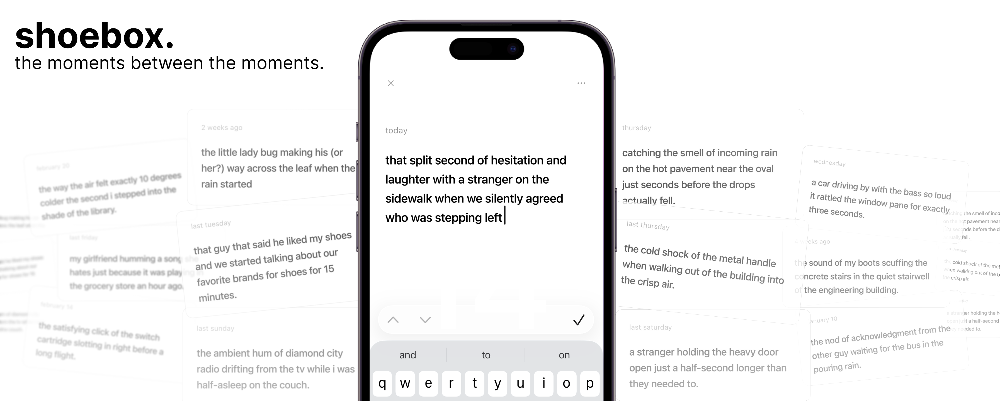

# shoebox

A minimalist, local-first memory archive designed for savoring.

**shoebox** is a single-file Progressive Web App (PWA) built to capture positive micro-interactions and small moments. It inverts the standard journaling model: the archive itself is the product, and the writing is just the excuse to add to it.

By intentionally logging and re-reading positive moments, shoebox acts as a lightweight, self-directed cognitive intervention to shift negative prediction errors and combat biased sampling in autobiographical memory. Or just something fun to read in your free time :)

## Features
- **Frictionless Capture:** Open the app and type. No folders, no tags, no mood trackers, no friction.
- **Snap-Scroll Archive:** A "Rolodex" style interface with peripheral fade that forces you to land on and appreciate each memory, rather than mindlessly skimming a feed.
- **Local-First & Private:** All data lives in your device's browser using IndexedDB. No ads, no tracking, no walled gardens, and no corporate backend.
- **GitHub Gist Sync (Optional):** True cross-device sync using a private GitHub Gist. It uses intelligent, append-aware merging (updated_at resolution) so you never lose a memory, even if you write offline on multiple devices.
- **Single-File Architecture:** The entire app—HTML, CSS, Vanilla JS, and the service worker—is contained entirely within one index.html file (~40KB).
- **Data Ownership:** Export your entire archive to a clean JSON file at any time.

## Getting Started
Because shoebox is a single-file PWA, deployment is entirely up to you.
1. Host index.html on any static server (GitHub Pages, Vercel, Netlify, or your own server).
2. Open the URL on your phone.
3. Tap **Share > Add to Home Screen (iOS)** or **Install App (Android)** for the native, fullscreen experience.

## Setting up Sync
Shoebox works perfectly offline-first without any account. If you want to sync your archive across devices:
1. Generate a **GitHub Personal Access Token** with gist scope.
2. Open shoebox and tap the "shoebox" label in the top-left corner to access **Settings.**
3. Paste your token into the GitHub Token field.
4. Tap **create new gist** to automatically provision a private sync file, or paste an existing Gist ID if you already have one.
5. Tap **save.** Shoebox will now automatically push when you save a new memory and pull when you open the app.

## Project Status
Shoebox is considered feature-complete. It was designed to do one thing perfectly without succumbing to feature creep (for once...). Future commits to this repository will be strictly limited to bug fixes and maintenance. This will be a great challenge for me...
